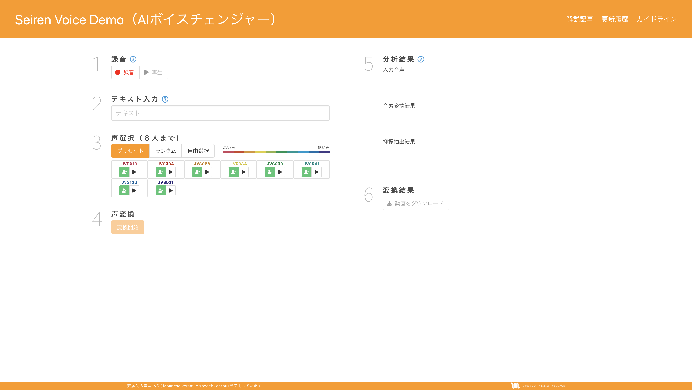
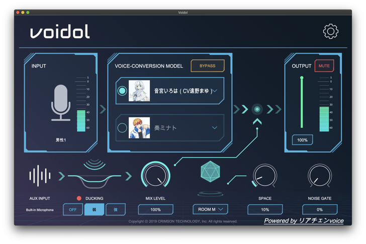
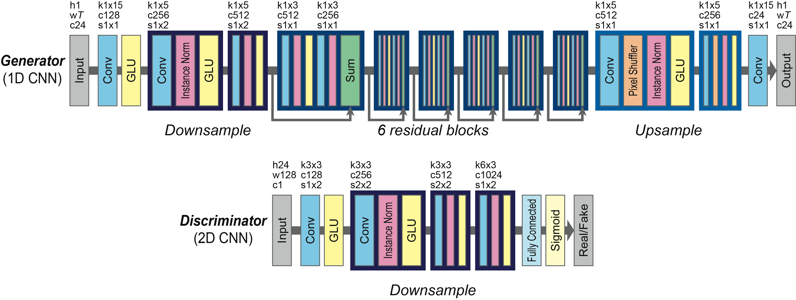
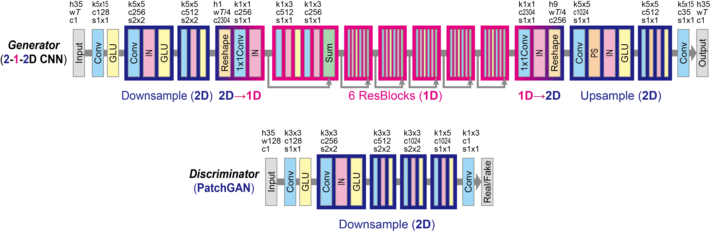
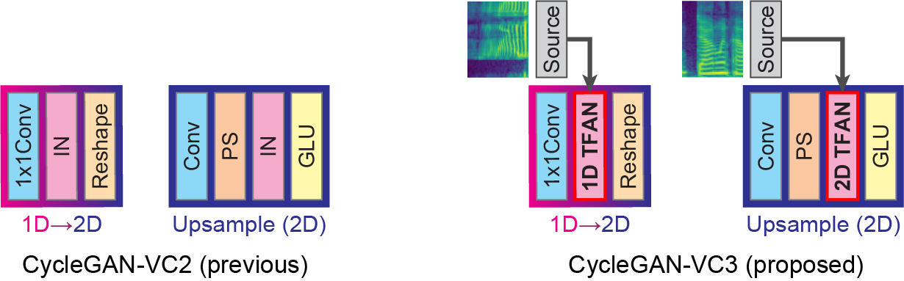

# 研究ワークシート

## テーマ名
リアルタイム Any-to-One 音声変換

## 領域・キーワード
- 音声変換(Voice Conversion)
- ボイスチェンジャー
- 音声合成
- 多対一
- リアルタイム
- 深層学習

<!--
FIXME: 抽象的すぎ？？
- 身体機能拡張
- 障碍者支援
- 創作活動
-->

## 動向調査

### ディープラーニングの力で誰でもゆかりさんの声になれる声変換技術を作ってみた
- any-to-one
- 高音質

[ディープラーニングの力で誰でもゆかりさんの声になれる声変換技術を作ってみた](https://blog.hiroshiba.jp/everybody-yukarin-with-deep-learning-power/)

### Seiren Voice
誰の声でも100人の声に変えられる声変換システム  
  
[Seiren Voice Demo（AIボイスチェンジャー）](https://seiren-voice.dmv.nico/)  
[誰の声でも100人の声に変えられる声変換システム](https://dmv.nico/ja/articles/seiren_voice/)  

### Voidol

- 業界初のAIリアルタイム声質変換アプリケーション
- クリムゾンテクノロジー株式会社が名古屋大学戸田教授と共同開発し、言語情報を保ちつつ、話者の声質のみを変換する技術で、統計的声質変換法を用いています。
- サンプリング周波数: 44100Hz ビット幅: 16bit
- 処理遅延: 100ms 以内
- 男性・女性対応ピッチシフト変換
- 本アプリは、リアチェンvoice PRO版と標準版のナレータの機械学習を省略した簡易版ですが、十分に声の変換を楽しむことが出来ます。

[voidol](https://crimsontech.jp/apps/voidol/)

### CycleGAN-VC

パラレルデータに依存しない高性能な音声変換モデル

[cycleGAN-VC](http://www.kecl.ntt.co.jp/people/kaneko.takuhiro/projects/cyclegan-vc/index.html)

#### CycleGAN-VC2

[cycleGAN-VC2](http://www.kecl.ntt.co.jp/people/kaneko.takuhiro/projects/cyclegan-vc2/index.html)

#### CycleGAN-VC3

[cycleGAN-VC3](http://www.kecl.ntt.co.jp/people/kaneko.takuhiro/projects/cyclegan-vc3/index.html)

## シーズ・ニーズ
- 問題点
  - 古典的ボイスチェンジャー同様に誰でもリアルタイムに使えない
  - 新しい声へ変換するには膨大な学習が必要
  - 深層学習を用いるので
- 解決すべき課題
  - 声を用いるコミュニケーションでのハンディキャップの軽減
  - 声を用いるコミュニケーションでのロールプレイなどでの活用
- トレードオフの解消
  - どんな声からでも確実に一つの声質特徴に変換できる
  - リアルタイムに目的の声を変換できる
- 改善(新規性&アイデア)
  - GANによるデータの拡張を用いてany-to-oneを実現する
  - WaveNet等の低速なモデルを用ないで文字に変換するなどの作業を用いないリアルタイムの音声変換
- 付加価値
  - 見た目のアバター化に合わせた声のアバター化ができる
  - 自分の声質に依存しないコミュニケーションが可能

## 対象
- 声にハンディキャップやコンプレックスを持つ者
- ゲームや配信などで声を用いたロールプレイを行う者

## 指標
- 平均オピニオン評点
- 選好試験
- 音声分類(異常検知)モデルでの検証
- 実証実験でのアンケート調査