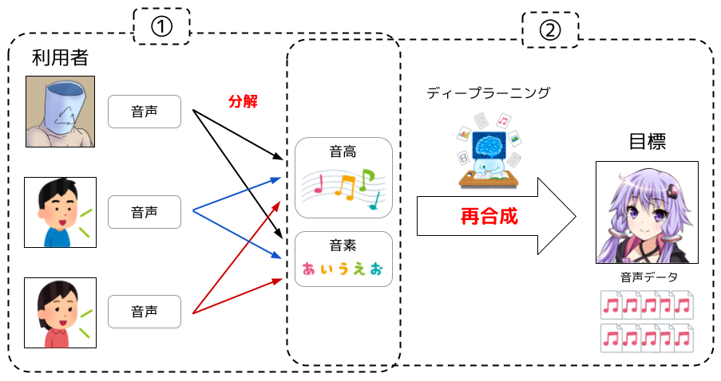

# 研究ワークシート

## テーマ名
**AutoVCを用いたZeroShotリアルタイム音声変換の提案**

## 領域・キーワード
- 深層学習
- 音声変換・声質変換
- Zero-shot learning
- リアルタイム

## テーマを要約すると
AutoVCは、many-to-manyの音声変換及び、ZeroShot音声変換が可能です。  
このAutoVCをリアルタイム化することで、名探偵コナンの蝶ネクタイ型変声機のようなものを再現することができる。  

ここでいうリアルタイムとは入力音声以下の秒数以下の秒数で変換ができることです。  

## 解説スライド
[こちら](https://docs.google.com/presentation/d/1GP8vfhLL26hQ1_5-KavN7qFaNSE8UzbHCzcuUxzEM9g/edit?usp=sharing)

## 動向調査

### 製品
- **Seiren Voice** 
  - 多対多声質変換
  - 文字列と音程に直す手法
  - [Seiren Voice Demo（AIボイスチェンジャー）](https://seiren-voice.dmv.nico/)  
  - [誰の声でも100人の声に変えられる声変換システム](https://dmv.nico/ja/articles/seiren_voice/)  

- **VOICE AVATAR 七声ニーナ**
  - 多対一声質変換
  - Seiren Voiceと同様に文字列に直す手法
  - [VOICE AVATAR 七声ニーナ](https://nanakoe-nina.dena.ai/)

- **Voidol**
  - 業界初のAIリアルタイム声質変換アプリケーション
  - クリムゾンテクノロジー株式会社が名古屋大学戸田教授と共同開発し、言語情報を保ちつつ、話者の声質のみを変換する技術で、統計的声質変換法を用いています。
  - サンプリング周波数: 44100Hz ビット幅: 16bit
  - 処理遅延: 100ms 以内
  - 男性・女性対応ピッチシフト変換
  - 本アプリは、リアチェンvoice PRO版と標準版のナレータの機械学習を省略した簡易版ですが、十分に声の変換を楽しむことが出来ます。

### 論文
- **[AUTOVC: Zero-Shot Voice Style Transfer with Only Autoencoder Loss](https://arxiv.org/abs/1905.05879)**
  - AutoEncoderを用いた学習
  - 多対多の音声変換
  - 「speaker embedding」を用いた条件付け
  - 初めてのZeroShot音声変換
  - [論文解説](https://aria3366.hatenablog.com/entry/2020/09/30/191230)

- **[F0-consistent many-to-many non-parallel voice conversion via conditional autoencoder](https://arxiv.org/pdf/2004.07370.pdf)**
  - AutoVCの弱点である音程の維持を克服した論文
  - デコーダの補助特徴量にF0を用いる
  - [解説スライド](https://www.slideshare.net/FujimotoKeisuke/f0-consistent-manytomany-nonparallel-voice-conversion-via-conditional-autoencoder)

- **[StarGAN-VC2:Rethinking Conditional Methods for StarGAN-Based Voice Conversion](http://www.kecl.ntt.co.jp/people/kaneko.takuhiro/projects/stargan-vc2/index.html)**
  - StarGANを用いた多対多声質変換
  - [解説](https://medium.com/@crosssceneofwindff/stargan-vc2%E3%82%92%E7%94%A8%E3%81%84%E3%81%9F%E8%A4%87%E6%95%B0%E8%A9%B1%E8%80%85%E9%96%93%E5%A3%B0%E8%B3%AA%E5%A4%89%E6%8F%9B-24869af1e122)

- **[StarGAN-ZSVC: Towards Zero-Shot Voice Conversion in Low-Resource Contexts](https://arxiv.org/abs/2106.00043)**
  - StarGAN-VCでZero-Shot学習を行う論文
  - MelSpectroglamを音声波形に復元する際に[waveglow](https://qiita.com/mitsu-h/items/fee770f73f95e217acf7)を用いる
  - [発表動画](https://www.youtube.com/watch?v=EvWff9UYQFw)

## シーズ・ニーズ
- 問題点
  - 研究レベルではZeroShot声質変換は可能であるが、実際に製品として使われる例はない
- 解決すべき課題
  - 変換精度を担保したまま、リアルタイムで変換を行う
- トレードオフの解消
  - 変換速度と変換精度のトレードオフの解消
- 改善(新規性&アイデア)
  - AutoVCをリアルタイムで利用できるようにする
    1. AutoVCによってMCEPを変換することでWorldのスキームで波形を復元でき高速化がはかれる
    2. AutoVCを複素ニューラルネット化して位相情報ごと変換する
- 付加価値
  - ゲームや配信などで音声変換を利用できる

## 対象
- 配信などのシステム内での利用

## 指標
- 平均オピニオン評点
- 選好試験
- 音声分類(異常検知)モデルでの検証