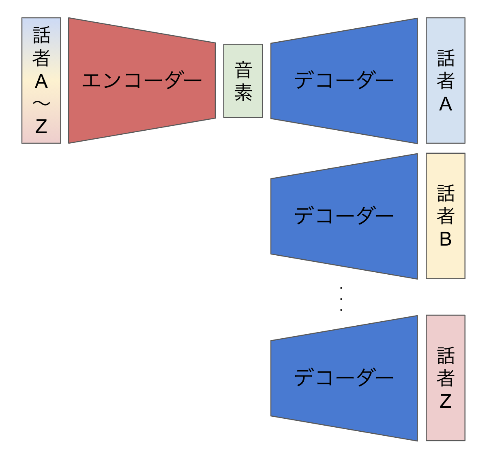

# CycleGAN-VC3を用いたデータ拡張とVQ-VAEを用いた音素の埋め込み表現

## 思いついたこと
現在Any-to-Oneでの音声変換の主流のやり方は  
音声→文字(音素)→音声 という風に変換を行っています。  
しかし、これでは無駄が多いのではないかと考えます。
以下が理由です。  

1. 音声から音素(Onehotベクトル)では消さなくていいものまで消しているのではないか？  
2. 高音質TTSを高速かつリアルタイムでは現状できないのではないか?  

この解決としてエンコーダーデコーダーモデルを用いて音素のみを圧縮して取り出すことができるのではないかと考えています。(VQ-VAEがいいのでは)

1. 話者A〜B(いっぱい)のパラレルデータを用意します。
2. 以下の画像のようにが学習させます。
3. するとエンコーダの出力として音素を表す行列(ベクトル)が出てくれと考えます。

この手法の問題点としてパラレルデータが大量に必要になるので  
それはCycleGAN-VC3を用いて作成します。

## この手法のキモ
- CycleGAN-VC3を用いてパラレルデータを拡張する
- 高速で軽量な音声変換(これは目標)

## 懸念点
- CycleGAN-VC3の入力に話者A~Zを入力して話者Aの声にAny-to-Oneの変換が可能か否か
- 現在の手法ではデコーダーにWaveNet等の低速なモデルを用いている事例が多くそのような構造をもたないモデルでも可能なのか？
<!--
- そもそも論として音素の抽出的なことは可能なのか？ ← AutoVCで可能
-->

## メモ
- そもそもAEを使って音素抽出、変換が可能なのか
  - AutoVCでやっているので可能であると考える
- AutoVCはSeq2Seqを用いたAEを使ってる
  - 自己回帰型のモデルでは遅いのでは？
  - その打開策の一つとしてとしてVQ-VAEを検証したい