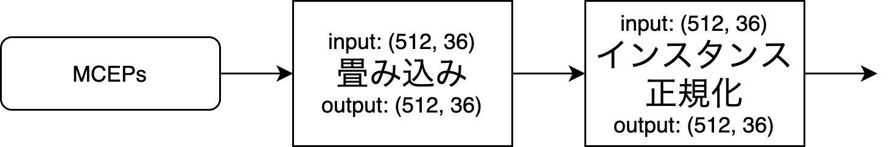

# AutoVC改良のための検証内容

AUTOVCにMCEPsを用いた際にうまく変換できない。  
そのため、その問題を解決するために行う検証の一覧

## 検証方法

- [x] ２倍学習
  - 単純に学習が足りていない場合はこれをすれば解決する
- [x] ノーマライズの無効化
  - 過度な正規化によって変換に用いる特徴を消している可能性がある
<!-- - [ ] モデルの変更
  - [ ] 特徴の入力の仕方の変更
    - 埋め込みベクトルを linear -> sigmoid をしたのち MCEPをConvしたチャンネルにそれをかけるAttention的な構造を用いる
  - [ ] ボトルネック部分をさらに圧縮する
  - [ ] ボトルネック部分を Vector Quantised する。 -->
- [ ] [モデル変更] 埋め込みベクトルが制約として作用していない

**form:**

**to:**

- [x] [モデル変更] Instance Normalization の使用

**form:**

**to:**

- [x] [モデル変更] CycleGAN-VCベースの独自モデルの作成
- [x] [モデル変更] CycleGAN-VCベースの独自モデル + SENet 

- [ ] [モデル変更(再検証)] CycleGAN-VCベースの独自モデルの作成
- [ ] [モデル変更(再検証)] CycleGAN-VCベースの独自モデル + SENet 

- [ ] [モデル変更] AutoVCを複素ニューラルネット化
- [ ] [モデル変更] Endoerをwav2vec2.0にするモデル。

<!-- 
- [ ] [モデル変更] PostNetの改良

- [ ] [モデル変更] 2DConvの追加

**form2:**

これが五個連なっています。

  - [ ] [案1] 2DConvの追加

  - [ ] [案2] 残差構造

 -->

## 結果
[こちら](https://suzukidaishi.github.io/PD3_results/)にまとめてあります。  