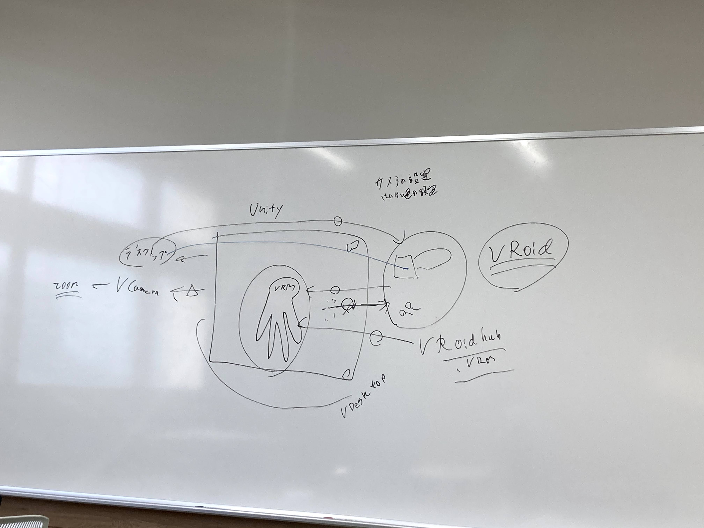

# 進捗報告書

報告書番号 | 氏名   | 期間         | 報告日
----- | ---- | ---------- | ---
13    | Suzuki Daishi | 06/15 ~ 06/21 | 06/22  

## 活動概要

- 研究概要
  - AutoVCを用いたZeroShotリアルタイム多対多音声変換の提案

- 進路状況
  - バンダイナムコスタジオ -> 明日二次先行
  - デジタル・フロンティア -> 一次先行結果待ち
  - データグリッド        -> 言えば社長面接
  - Tengun-label        -> 言えば社長面接

- 研究活動
  - StarGANを用いたモデルの学習
    - 検証結果は1倍,2倍,4倍ともに良い結果は出なかった
  - 複素ニューラルネットでの実装
    - 実装の調査
      - https://github.com/wavefrontshaping/complexPyTorch
    - メルスペクトログラムの複素数化の調査
  - StarGAN-ZSVCを発見した
    - StarGAN-VCを用いてZeroshot学習をさせた論文
  - コンセプトシートを書いた
    - 途中

- その他の活動
  - Unityを使った配信システムの構築
    - 白峰の夏用 & 趣味用
    - https://twitter.com/zukky_rikugame/status/1407004501131677701?s=20

- 反省点と振り返り
  - 就活や他の作業で研究が疎かになった

## 活動予定

- ６月中
  - AutoVC
    - AutoVCの複素ニューラルネット化
      - 問題点: 位相を維持したままMelSpectrogram化のやり方がわからない

## 研究室に来る日程と時間帯

| 月             | 火            | 水            | 木            | 金             | 土
| ------------- | ------------- | ------------- | ------------- | ------------- | -------------
| バイト | 13:00 ~ 19:00 | 鷹合研ゼミ | 13:00 ~ 19:00 | バイト | バイト

