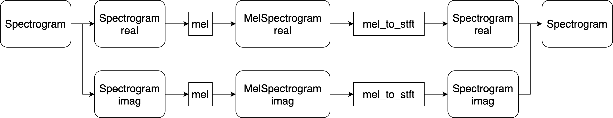

# 進捗報告書

報告書番号 | 氏名   | 期間         | 報告日
----- | ---- | ---------- | ---
14    | Suzuki Daishi | 06/22 ~ 07/05 | 07/6  

## 活動概要

- 研究概要
  - AutoVCを用いたZeroShotリアルタイム音声変換の提案

- 進路状況
  - バンダイナムコスタジオ -> 昨日最終面接(結果待ち)
  - デジタル・フロンティア -> 落ちました
  - データグリッド        -> 一次面接(結果待ち)
  - Tengun-label        -> 言えば社長面接

- 研究活動
  - 複素ニューラルネットでの実装
    - メルスペクトログラムの複素数化の調査
    - 以下の手法で可能では？(船田先生に聞きました)

- その他の活動
  - 白峰BS
    - Stylyの勉強
    - Unityの勉強
    - 楽曲のリミックス
    - 3d骨格抽出手法
      - https://youtu.be/jhalsqttBvg
  - NT金沢を見に行った

- 反省点と振り返り
  - 色々あって研究の進捗が遅いので来週しっかりと進められるようにがんばります。

## 活動予定

- 7月中
  - AutoVC
    - AutoVCの複素ニューラルネット化
      - モデルの完成
      - モデルの前処理完成
      - モデルの学習
      - モデルの検証
    - WaveGlowの検証

## 研究室に来る日程と時間帯

| 月             | 火            | 水            | 木            | 金             | 土
| ------------- | ------------- | ------------- | ------------- | ------------- | -------------
| バイト | 13:00 ~ 19:00 | 鷹合研ゼミ | 13:00 ~ 19:00 | バイト | バイト

