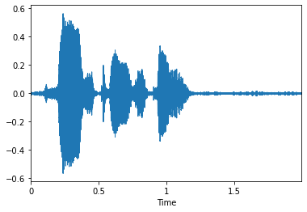
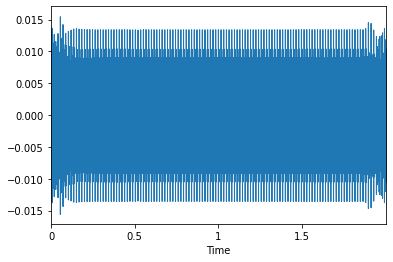
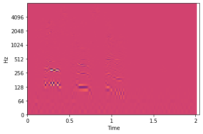
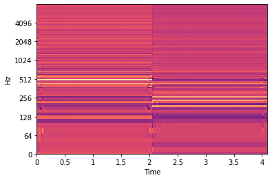
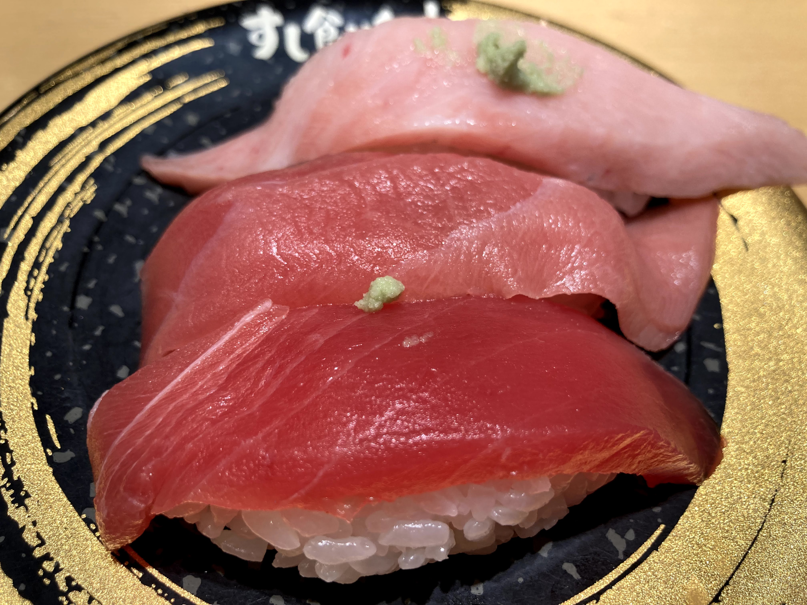
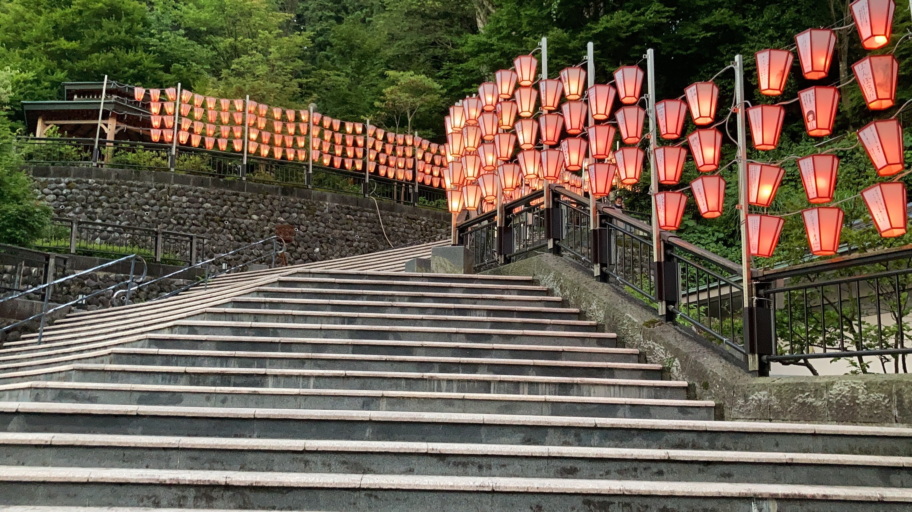

# 進捗報告書

報告書番号 | 氏名   | 期間         | 報告日
----- | ---- | ---------- | ---
17    | Suzuki Daishi | 07/20 ~ 07/26 | 07/27

## 活動概要

- 研究概要
  - AutoVCを用いたZeroShotリアルタイム音声変換の提案

- 進路状況
  - バンダイナムコスタジオ -> 内定
  - データグリッド        -> 再一次面接の結果まち
  - Tengun-label        -> 週末に面接

- 研究活動
  - ComplexAutoVCの検証
    - 300エポックの時点
      - 学習がうまくいかない
    - 検証
      - 前処理のテストコードの作成
      - 簡単なオートエンコーダモデルで学習させAEとして正しく学習するかの検証(途中)

- その他の活動
  - 白峰BS
    - 3Dアートの作成と技術調査
  - 鷹合研究室の先輩にお寿司を奢ってもらいました
    - 
  - 湯涌ぼんぼりまつりのぼんぼり点灯式に行きました
    - 

- 反省点と振り返り
  - 他のことが重なり忙しくなってきたのでしっかりと１日の予定をたてて行動したい

## 活動予定

- 7月中
  - AutoVC
    - AutoVCの複素ニューラルネット化
      - [ ] モデルの完成
      - [ ] モデルの前処理完成
      - [ ] モデルの学習
      - [ ] モデルの検証
    - WaveGlowの検証

## 研究室に来る日程と時間帯

| 月             | 火            | 水            | 木            | 金             | 土
| ------------- | ------------- | ------------- | ------------- | ------------- | -------------
| 東京で面接 | 13:00 ~ 19:00 | 鷹合研ゼミ | 13:00 ~ 19:00 | バイト | バイト

