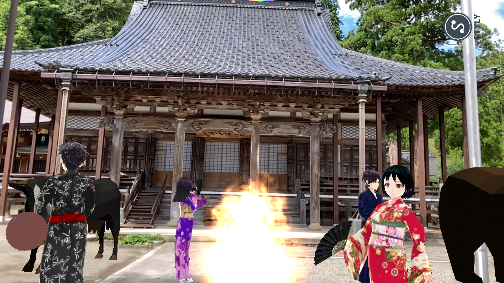
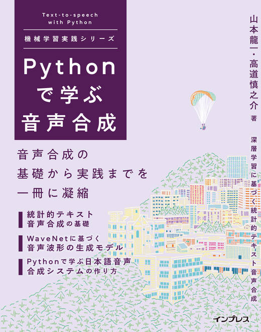

# 進捗報告書

報告書番号 | 氏名   | 期間         | 報告日
----- | ---- | ---------- | ---
18    | Suzuki Daishi | 08/03 ~ 08/23 | 08/24

## 活動概要

- 研究概要
  - AutoVCを用いたZeroShotリアルタイム音声変換の提案

- 進路状況
  - バンダイナムコスタジオにしました。
  - 終わり

- 研究活動
  - ComplexAutoVCの検証をした。
    - Unetの検証はまだ
  - [動向調査](../memo/動向調査.md)をした
    - 一度今回調査したモデル3つを動かして検証したい
    - もし、WaveGlowを用いた方法でリアルタイム化できるならば手法を大きく変える必要があるかもしれない

- その他の活動
  - 白峰BS
    - 
  - [Pythonで学ぶ音声合成 機械学習実践シリーズ](https://book.impress.co.jp/books/1120101073)を買いました
    - 
    - 良さげです!

- 反省点と振り返り
  - 忙しいのが終わったので研究に専念したい

## 活動予定

- 8月中
  - AutoVC(F0)の検証
  - ConVoiceの検証

## 研究室に来る日程と時間帯

| 月             | 火            | 水            | 木            | 金             | 土
| ------------- | ------------- | ------------- | ------------- | ------------- | -------------
| バイト | 13:00 ~ 19:00 | 鷹合研ゼミ | 13:00 ~ 19:00 | バイト | バイト

