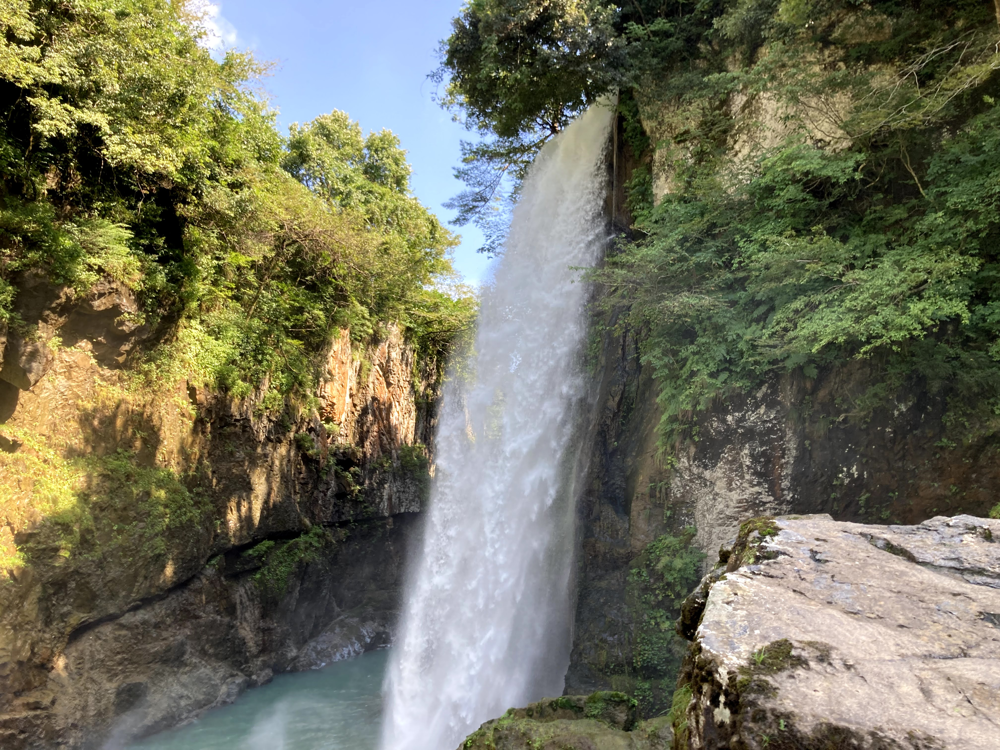

# 進捗報告書

報告書番号 | 氏名   | 期間         | 報告日
----- | ---- | ---------- | ---
20    | Suzuki Daishi | 08/24 ~ 08/30 | 08/31

## 活動概要

- 研究概要
  - AutoVCを用いたZeroShotリアルタイム音声変換の提案

- 研究活動
  - ComplexAutoVCの検証をした。
    - Unetの検証
      - 学習終了
      - 検証用コードの作成(途中)
    - AutoVC(実部と虚部を分ける)
      - 学習開始
  - WaveGlow
    - [colab](https://colab.research.google.com/drive/1mTPufUaQpF8O8O4Di3oOCJ_9E6u1oyMu#scrollTo=fBiI7DQB-6qG)
    - 環境によって異なるがV100ならリアルタイムで処理できそう
  - 今後の方針
    - 現実的な環境(nvidia rtx 3080)でリアルタイムを実現
    - 検証したいこと
      - 複素AutoVC
        - モデルにバグがないかの検証
      - WorldAutoVC
        - スペクトル包絡 を特徴量にしたモデル
        - スペクトル包絡 + 非周期性指標 を特徴量にしたモデル
- その他の活動
  - ダイエットを始めます
  - 単位取りました
  - 取材を受けに行きましたが...
    - 
    - 

- 反省点と振り返り
  - 帰省しても進捗を出し続けたい

## 活動予定

- 8月中
  - AutoVC(F0)の検証
  - ConVoiceの検証

## 研究室に来る日程と時間帯

| 月             | 火            | 水            | 木            | 金             | 土
| ------------- | ------------- | ------------- | ------------- | ------------- | -------------
| 帰省 | 13:00 ~ 19:00 | バイト | 13:00 ~ 19:00 | バイト | バイト