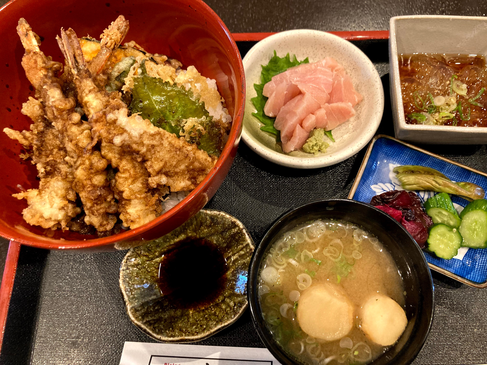

# 進捗報告書

報告書番号 | 氏名   | 期間         | 報告日
----- | ---- | ---------- | ---
21    | Suzuki Daishi | 08/31 ~ 09/06 | 08/07

## 活動概要

- 研究概要
  - AutoVCを用いたZeroShotリアルタイム音声変換の提案

- 研究活動
  - ComplexAutoVCの検証をした。
    - Unetの検証
    - AutoVC(実部と虚部を分ける)
  - WorldでAutoVCの検証した
    - 検証中
  - [こちら](https://docs.google.com/presentation/d/1n_scsLlNkSdhbn7VIy0HLBYQi_0DHLCng-TGjra4u-A/edit?usp=sharing)にまとめた
  - [中間発表ポスター](../concept/中間発表ポスター.pdf)を描いた
- その他の活動
  - 美味しい天丼屋を見つけました
    - 

- 反省点と振り返り
  - 早く中間発表関連の資料を書きたい

## 活動予定

- 9月中
  - World方式での音声変換の検証
  - 複素化方式での検証

## 研究室に来る日程と時間帯

| 月             | 火            | 水            | 木            | 金             | 土
| ------------- | ------------- | ------------- | ------------- | ------------- | -------------
| バイト | 13:00 ~ 19:00 | バイト | 13:00 ~ 19:00 | バイト | バイト