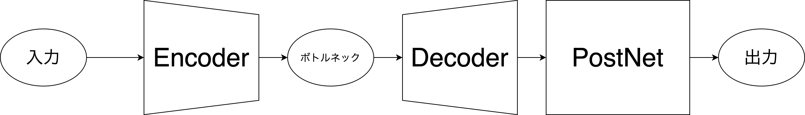

# 進捗報告書

報告書番号 | 氏名   | 期間         | 報告日
----- | ---- | ---------- | ---
22    | Suzuki Daishi | 09/14 ~ 09/27 | 09/28

## 活動概要

- 研究概要
  - AutoVCを用いたZeroShotリアルタイム音声変換の提案

- 研究活動
  - 今後の予定
    - 変換精度向上
    - 他の手法の調査
    - 比較検証
  - **変換精度向上**
    - 
    - 精度向上の方法  
      1. EncoderとDecoderのConvのフィルタ数を2倍にする。
      2. ボトルネックの幅を2倍にする。
      3. PostNetの表現力を上げる
    - 他の手法の調査
      - [LPCNet: Improving Neural Speech Synthesis Through Linear Prediction](https://arxiv.org/abs/1810.11846)の調査
        - 参考文献: [リアルタイムニューラルボコーダにおける学習データ量の影響の調査](http://www.me.cs.scitec.kobe-u.ac.jp/~takigu/pdf/2020/0104_1-2-3.pdf)
      - [Basis-MelGAN: Efficient Neural Vocoder Based on Audio Decomposition](https://arxiv.org/abs/2106.13419)の調査
      - ニューラルボコーダーのRTFのstate-of-the-art
    - 比較検証
      - MOSを図るためのアンケートを作成
        - 類似度を5(似てる)~1(似てない)で判断
        - 客観的なMOSとして[MOSNet: Deep Learning based Objective Assessment for Voice Conversion](https://arxiv.org/abs/1904.08352)も調査

- その他の活動
  - 自然言語の勉強会をしました
    - [colab](https://colab.research.google.com/drive/1yDEGLZpjjfohNjp-N_mI0kipavrXCg1w?usp=sharing)
  - 今はフーリエ変換の勉強会やってます。

- 反省点と振り返り
  - 早く中間発表関連の資料を書きたい

## 活動予定

- 10月中
  - 変換精度向上
  - 他の手法の調査
  - 比較検証

## 研究室に来る日程と時間帯

| 月             | 火            | 水            | 木            | 金             | 土
| ------------- | ------------- | ------------- | ------------- | ------------- | -------------
| バイト | バイト| 12:00 ~ 19:00  | 鷹合研ゼミ | 10:00 ~ 14:00　| バイト