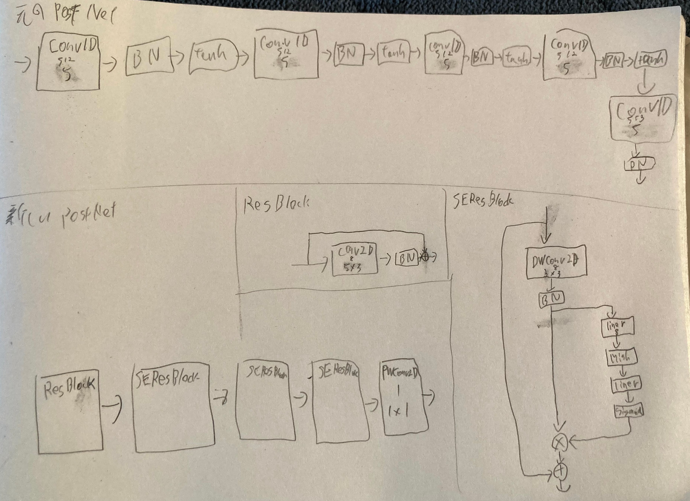

# 進捗報告書

報告書番号 | 氏名   | 期間         | 報告日
----- | ---- | ---------- | ---
23    | Suzuki Daishi | 10/05 ~ 10/11 | 10/12

## 活動概要

- 研究概要
  - AutoVCを用いたZeroShotリアルタイム音声変換の提案

- 研究活動
  - アンケート作成
    - [アンケート](https://suzukidaishi.github.io/pd3-enquete/)
    - [結果](https://docs.google.com/spreadsheets/d/1_UgoNn5r50J8VTf8kDrYBOdPEx1jQj2fIb6xzk5-fOw/edit?usp=sharing)
    - 比較対象
      - train, test, unseen
      - 男性, 女性
      - 高い声, 低い声
      - モデル
        - [x] AutoVC(既存手法)
        - [ ] ~~AutoVC F0(既存手法の改良版)~~
        - [x] AutoVC World(提案手法)
        - [ ] AutoVC World(提案手法, フィルタ枚数2倍)
        - [ ] AutoVC World(提案手法, ボトルネック2倍)
  - 変換手法の改良
    - **PostNet改良**
      - SEBlockを用いた手法
      - 
    - Encoder, Decoderの改良
      - SEBlockを用いた手法
      - ViTを用いた手法
    - CTCLossを導入したモデルの作成

## 活動予定

- 10月中
  - 変換精度向上
  - 他の手法の調査
  - 比較検証

## 研究室に来る日程と時間帯

| 月             | 火            | 水            | 木            | 金             | 土
| ------------- | ------------- | ------------- | ------------- | ------------- | -------------
| バイト | 12:00 ~ 19:00  | 12:00 ~ 19:00 | 鷹合研ゼミ | 10:00 ~ 14:00　| バイト