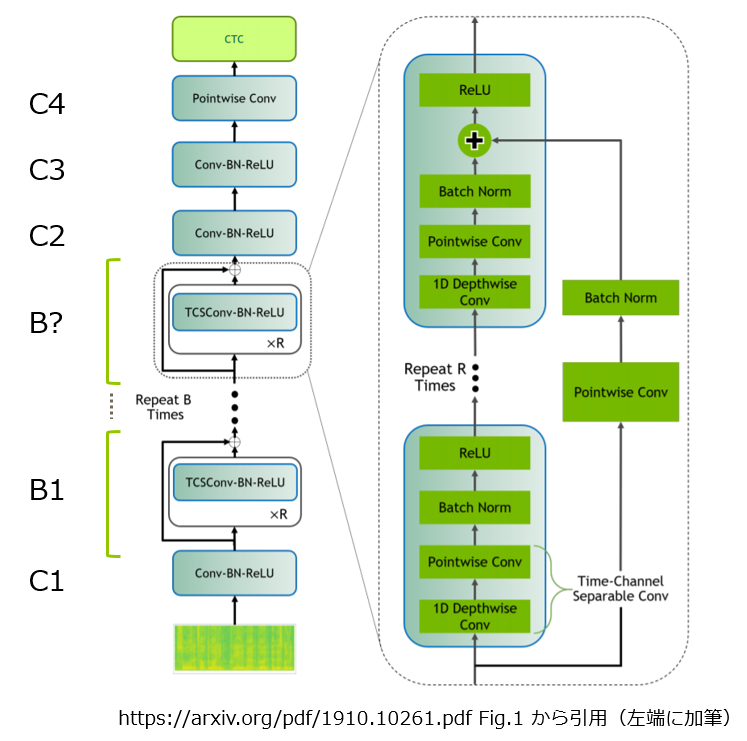

# 進捗報告書

報告書番号 | 氏名   | 期間         | 報告日
----- | ---- | ---------- | ---
23    | Suzuki Daishi | 10/12 ~ 10/18 | 10/19

## 活動概要

- **研究概要**
  - AutoVCを用いたZeroShotリアルタイム音声変換の提案

- **研究活動**
  - 論文作成
    - アンケート調査
      - [アンケート](https://suzukidaishi.github.io/pd3-enquete/)
      - [結果](https://docs.google.com/spreadsheets/d/1_UgoNn5r50J8VTf8kDrYBOdPEx1jQj2fIb6xzk5-fOw/edit?usp=sharing)
      - 今週の進捗
        - アンケート(フロントエンド完成)
        - アンケート内容の音源生成用プログラム
          - [x] AutoVC(既存手法EN)
          - [x] AutoVC World(提案手法EN)
          - [x] AutoVC World(提案手法EN, フィルタ枚数2倍)
          - [x] AutoVC World(提案手法EN, ボトルネック2倍)
          - [x] AutoVC(既存手法JP)
          - [x] AutoVC World(提案手法JP)
          - [ ] AutoVC World(提案手法, フィルタ枚数2倍)
            - モデルの読み込みの際にエラーが出る。
            - 検証中
          - [x] AutoVC World(提案手法, ボトルネック2倍)
  - 変換手法の改良
    - ConVoiceの作成
      - 内部で用いられるQuartzNetの作成中
      - 

## 活動予定

- 10月中
  - DPS研究会に向けた 論文のテーマ, アブストの作成
  - アンケート調査, 時間測定による 精度検証
  - 時間があれば ConVoiceの作成

## 研究室に来る日程と時間帯

| 月             | 火            | 水            | 木            | 金             | 土
| ------------- | ------------- | ------------- | ------------- | ------------- | -------------
| バイト | 12:00 ~ 19:00  | 12:00 ~ 19:00 | 鷹合研ゼミ | 車校　| バイト