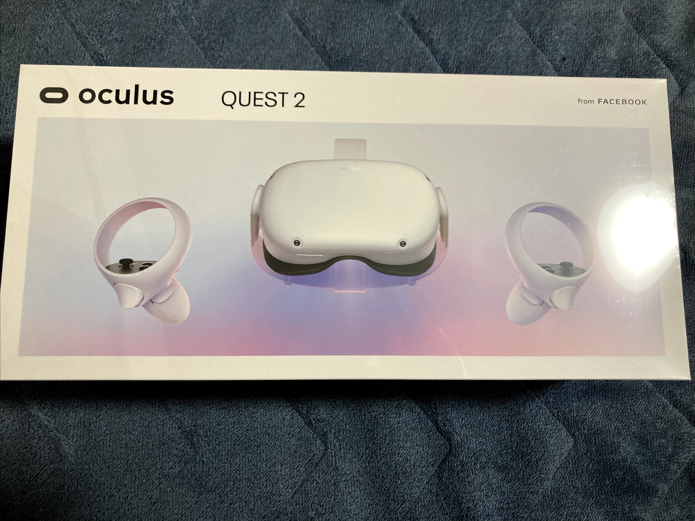

# 進捗報告書

報告書番号 | 氏名   | 期間         | 報告日
----- | ---- | ---------- | ---
08    | Suzuki Daishi | 04/27 ~ 05/10 | 05/11

## 活動概要

- 研究概要
  - リアルタイム Any-to-One 音声変換

- 進路状況
  - バンダイナムコスタジオ -> 明日あたりSPI
  - DMM -> 企業調査してます
  - ピクシブ -> 受けようかな？？

- 研究活動
  - MCEPs用のモデル及び学習基盤の完成
  - MCEPsモデル学習完了
- その他の活動
  - oculus quest 2 購入しました

- 振り返り事項
  - 反省事項
    - ちょっと五月病気味です
  - よかったこと
    - とりあえず最低ライン達成でよかったです。

## 活動予定

  - 今後の活動
    - 5月末までに以下のことを検証
      - [x] 実装と論文に差異は無いかの検証
      - [ ] 高速化のために現在のモデルで精度や速度を検証
      - [x] AutoVCのMCEPsを使った実装の開発
      - [x] https://arxiv.org/abs/1905.05879 を落合メソッドでまとめる
      - [ ] https://arxiv.org/abs/2004.07370 を落合メソッドでまとめる
      - [ ] https://auspicious3000.github.io/SpeechSplit-Demo/ を読む
      - [ ] https://arxiv.org/abs/2004.11284 を落合メソッドでまとめる
      - [ ] コンセプトシートを充実させる
    - 6月までにMCEPsのモデル完成

## 研究室に来る日程と時間帯

| 月             | 火            | 水            | 木            | 金             | 土
| ------------- | ------------- | ------------- | ------------- | ------------- | -------------
| 00:00 ~ 00:00 | 00:00 ~ 00:00 | 00:00 ~ 00:00 | 00:00 ~ 00:00 | 00:00 ~ 00:00 | 00:00 ~ 00:00
